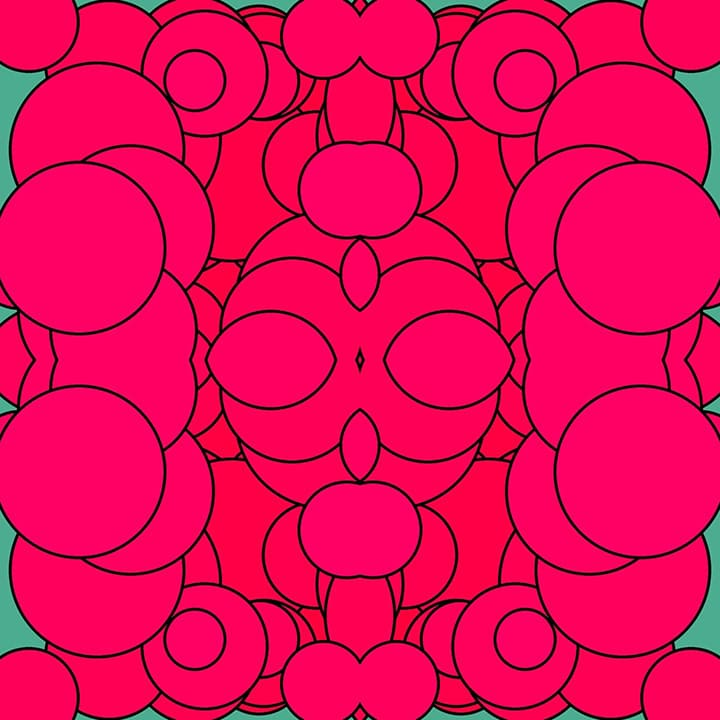
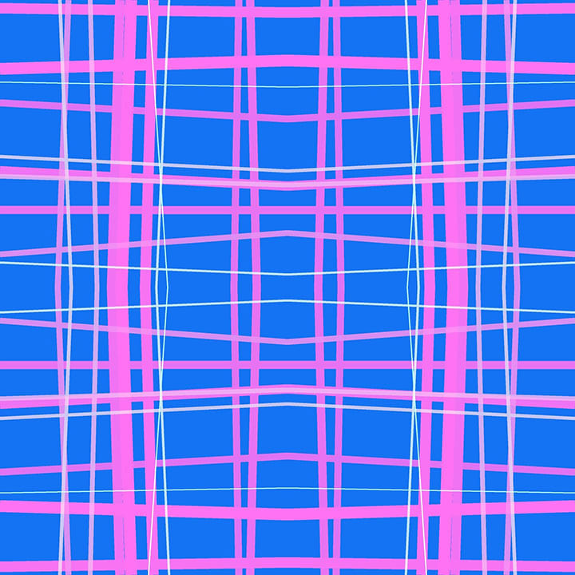
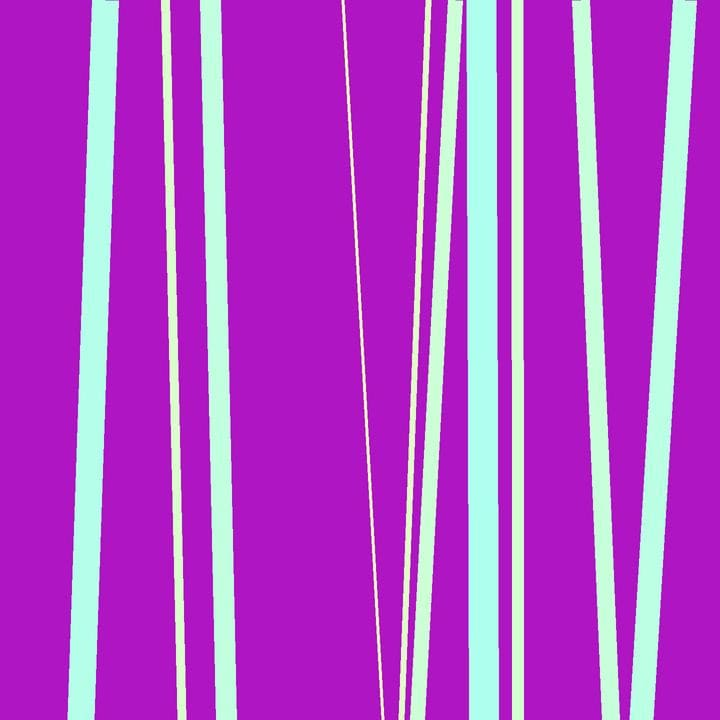

# Random Art Generator


The Random Art Generator is a Python-based tool for creating abstract and patterned images programmatically. It provides a variety of options to customize the generated artwork, allowing users to explore different artistic styles and patterns.

## Features

- **Image Generation Options:**
  - Horizontal and vertical lines
  - Random lines within specified boundaries
  - Circles with customizable radius and stroke
  - Rectangles with variable sizes and styles
  - Randomly placed small dots
  - Background color and padding adjustments

- **Color Customization:**
  - Choose start and end colors for gradients
  - Randomize colors for different elements

- **Effects and Transformations:**
  - Apply blending modes (add, subtract, multiply, etc.) to layers
  - Mirror images for symmetrical patterns
  - Create seamless patterns by tiling images

## Installation

1. **Clone the repository:**

   ```bash
   git clone https://github.com/Nafi7393/Random-Art-Generator.git
   cd Random-Art-Generator
   ```

2. **Install dependencies:**

   Make sure you have Python 3.x installed. Install the required libraries using pip:

   ```bash
   pip install -r requirements.txt
   ```

## Usage

To generate artwork using the Random Art Generator, run the `art_generator.py` script with Python:

```bash
python art_generator.py
```

### Options

- **Basic Options:**
  - `image_size`: Size of the output image (in pixels).
  - `bg_color`: Background color of the image.
  - `num_lines`: Number of lines (for horizontal, vertical, or random lines).
  - `padding_`: Option to add padding around the artwork.

- **Artistic Elements:**
  - `horizontal`: Generate horizontal lines.
  - `vertical`: Generate vertical lines.
  - `random_line`: Generate random lines.
  - `circle`: Generate circles.
  - `rect`: Generate rectangles.
  - `small_dots`: Generate small dots.

- **Customization:**
  - `start_color`, `end_color`: Colors for gradients or elements.
  - `cir_radius`: Radius for circles.
  - `stroke_clr`, `stroke_width`: Color and width of strokes (for circles and rectangles).
  - `rectangle_size`: Size range for rectangles.
  - `style`: Style option for rectangles and circles.
  - `num_of_dots`, `dot_clr`: Number and color of small dots.
  - `effect`: Blending effect applied to layers (add, subtract, multiply, etc.).


## Image Previews

### Circle Patterns

|              Circle-Diagonal                 |                    Circle-Diagonal-Seamless                    |
|:--------------------------------------------:|:--------------------------------------------------------------:|
|  |  |

|              Circle-Random               |                   Circle-Random-Seamless                   |
|:----------------------------------------:|:----------------------------------------------------------:|
|  |  |

### Line Patterns

|                     Horizontal & Vertical Lines                       |                          Horizontal & Vertical Lines - Seamless                           |
|:---------------------------------------------------------------------:|:-----------------------------------------------------------------------------------------:|
|  |  |

|               Horizontal Lines                |                    Horizontal Lines - Seamless                    |
|:---------------------------------------------:|:-----------------------------------------------------------------:|
|  |  |

|             Random Lines              |                  Random Lines - Seamless                  |
|:-------------------------------------:|:---------------------------------------------------------:|
|  |  |

|              Vertical Lines               |                   Vertical Lines - Seamless                   |
|:-----------------------------------------:|:-------------------------------------------------------------:|
|  |  |

### Rectangle Patterns

|                Rectangle-Diagonal                  |                     Rectangle-Diagonal-Seamless                      |
|:--------------------------------------------------:|:--------------------------------------------------------------------:|
|  |  |

|               Rectangle-Random                 |                    Rectangle-Random-Seamless                     |
|:----------------------------------------------:|:----------------------------------------------------------------:|
|  |  |

### Seamless Pattern Previews

|                                Circle-Diagonal-Seamless-PREVIEW                                |                               Circle-Random-Seamless-PREVIEW                               |
|:----------------------------------------------------------------------------------------------:|:------------------------------------------------------------------------------------------:|
|  |  |

|                                      Horizontal & Vertical Lines - Seamless-PREVIEW                                       |                                Horizontal Lines - Seamless-PREVIEW                                |
|:-------------------------------------------------------------------------------------------------------------------------:|:-------------------------------------------------------------------------------------------------:|
|  |  |

|                              Random Lines - Seamless-PREVIEW                              |                               Vertical Lines - Seamless-PREVIEW                               |
|:-----------------------------------------------------------------------------------------:|:---------------------------------------------------------------------------------------------:|
|  |  |

|                                Rectangle-Random-Seamless-PREVIEW                                 |                                 Rectangle-Diagonal-Seamless-PREVIEW                                  |
|:------------------------------------------------------------------------------------------------:|:----------------------------------------------------------------------------------------------------:|
|  |  |

## Contributing

Contributions are welcome! Feel free to open issues and pull requests for bug fixes, enhancements, or new features.
